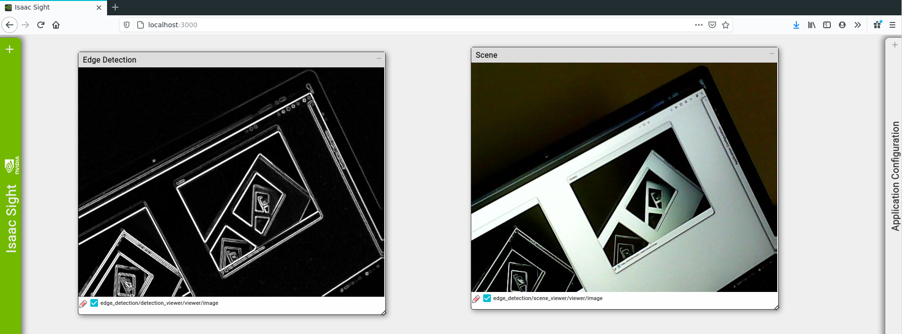

# Edge Detection in Nvidia Isaac using Python

As it says on the tin.



## Setup

Make sure you have Nvidia Isaac (2020.2) set up. Clone the repo in the `sdk/apps` directory

```
~/isaac/sdk/apps$ git clone https://github.com/firekind/isaac_edge_detection
```

## Run

### Using V4L2 Camera
To run the application using a V4L2 camera, attach the camera and note its device id. Edit the `device_id` under the `config` section of [`graphs/edge_detection.app.json`](https://github.com/firekind/isaac_edge_detection/blob/master/graphs/edge_detection.app.json#L81) file. Then, in the `sdk` directory, run:

```
~/isaac/sdk$ bazel run //apps/isaac_edge_detection:edge_detection
```

and open `localhost:3000` on the browser to see the results.

### Using Isaac Sim (Unity 3d)

Make sure Isaac Sim (Unity 3d) is downloaded, and a scene from isaac sim is running. A scene can be started using:

```
~/isaac-sim-unity3d/builds$ ./sample.x86_64 --scene small_warehouse
```

And then run the application using:

```
~/isaac/sdk$ bazel run //apps/isaac_edge_detection:edge_detection -- --simulate
```

and open `localhost:3000` on the browser to see the results.
